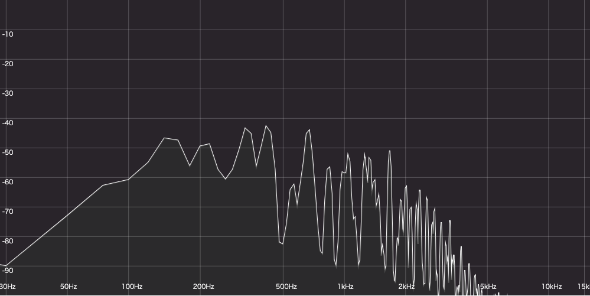

## aves

Audio spectrum analyzer written in type script.
Developed using web audio api.



# Example

```js
aves = new Aves()
// Decode asynchronously
// Use ArrayBuffer for input audio
aves.loadAudio(audioData).then(() => {
  const canvasElm = document.querySelector('#canvas')
  aves.createSpectrumAnalyser(canvasElm, 1000, 500)
})
```

